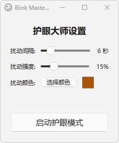

# Blink Master - 护眼大师 v1.0

一个通过微妙的视觉扰动提醒您增加眨眼次数，从而缓解眼部疲劳的桌面小工具。

*A desktop gadget that reminds you to blink through subtle visual disturbances to alleviate eye fatigue.*

---

### 截图预览 (Screenshot)

 
### 背景 (The "Why")

科学研究表明，当人们专注于电脑屏幕时，眨眼频率会从正常的每分钟15-20次显著下降到4-7次。眨眼次数的减少导致泪液蒸发过快，从而引发眼睛干涩、疲劳、视力模糊等一系列“计算机视觉综合症”。

许多提醒工具通过弹窗或声音来打断工作流，反而会造成干扰。Blink Master 另辟蹊径，它采用了一种更优雅、更符合人类下意识反应的解决方案。

### 功能特性 (Features)

* **柔和的视觉扰动**：周期性地在全屏产生一次极其微妙、平滑的半透明“呼吸”效果，利用人眼的周边视觉系统，在不打断您思路的情况下，下意识地触发您的眨眼反射。
* **高度可定制**：您可以自由调节视觉扰动的**频率**（多久一次）、**强度**（透明度）和**颜色**，找到最适合您的个性化方案。
* **系统托盘运行**：主窗口关闭后会自动最小化到系统托盘（右下角通知区域）安静运行，不占用您的任务栏空间。
* **轻量且高效**：采用现代化的图形渲染技术，CPU和内存占用极低，对您的电脑性能影响微乎其微。
* **无需安装**：绿色软件，下载解压后即可直接运行。

### 下载与安装 (Getting Started)

对于普通用户，您无需关心源代码，可以直接下载打包好的程序。

1.  前往本项目的 [**Releases**](https://github.com/your-username/your-repository-name/releases) 页面。 
2.  双击 `BlinkMaster.exe` 即可运行！

### 如何使用 (Usage)

1.  **运行程序**：双击 `BlinkMaster.exe` 启动。
2.  **调整设置**：在主窗口中，根据您的偏好调整滑块和颜色。
3.  **启动模式**：点击“启动护眼模式”，程序将开始在后台工作。
4.  **最小化**：您可以直接关闭主窗口，程序会自动最小化到系统托盘。
5.  **恢复窗口**：单击系统托盘中的程序图标，可以再次显示主窗口以调整设置。
6.  **退出程序**：**右键单击**系统托盘中的程序图标，然后选择“退出”即可完全关闭程序。

开发协作：Gemini
